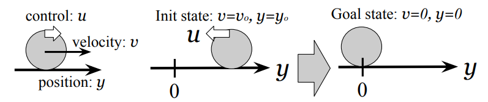
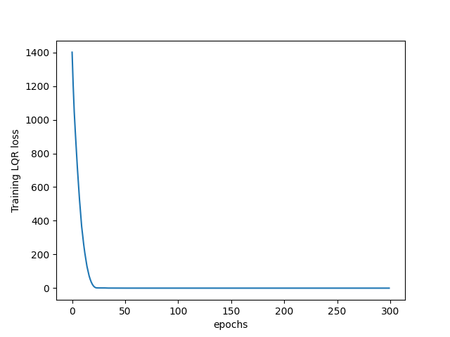

# FedAvg Optimization On LQR Control Of A 1-Dimensional Point Mass "Robot"

Implementation of the vanilla federated learning paper in setting of LQR control of a 1-dimensional point mass "robot" shown as ```Fig 1```: [Communication-Efficient Learning of Deep Networks from Decentralized Data](https://arxiv.org/abs/1602.05629) and [Personalized Federated Learning of Driver Prediction Models for Autonomous Driving](https://arxiv.org/abs/2112.00956).

<div align="center">
    
  
</div>

Experiments are produced on synthetic non-iid dataset.

Since the purpose of these experiments are to illustrate the performance of the federated learning paradigm, only simple models such as `DynamicsModel`(LQR controller and unit-mass system) are used.

## Requirments
Install all the packages from requirments.txt
* Python3.7
* Pytorch
* Torchvision

## Data
Execute the following code to generate a synthetic dataset involving `3` robots in the `./data` directory.
```
python3 src/generate_data_main.py
```

## Running the experiments
The baseline experiment trains the model on the default data of robot `1`.

* To run the baseline experiment with synthetic dataset on DynamicsModel using CPU:
```
python3 src/baseline_main.py --lr=0.01 --local_ep=300 --local_bs=10
```
* Or to run it on GPU (eg: if gpu:0 is available):
```
python3 baseline_main.py --lr=0.01 --local_ep=300 --local_bs=10 --gpu=0
```
-----

Federated experiment involves training a global model using many local models.

* To run the federated experiment with synthetic dataset on DynamicsModel:
```
python3 federated_main.py --lr=0.01 --local_ep=50 --local_bs=10 --gpu=0
```


You can change the default values of other parameters to simulate different conditions. Refer to the options section.

## Options
The default values for various paramters parsed to the experiment are given in ```options.py```. Details are given some of those parameters:

* ```--dataset:```  Default: 'synthetic dataset'.
* ```--model:```    Default: 'DynamicsModel'.
* ```--gpu:```      Default: None (runs on CPU). Can also be set to the specific gpu id.
* ```--epochs:```   Number of rounds of training.
* ```--lr:```       Learning rate set to 0.01 by default.
* ```--verbose:```  Detailed log outputs. Activated by default, set to 0 to deactivate.
* ```--seed:```     Random Seed. Default set to 1.

#### Federated Parameters
* ```--iid:```      Distribution of data amongst users. Default set to IID. Set to 0 for non-IID.
* ```--num_users:```Number of robots. Default is 3.
* ```--frac:```     Fraction of robots to be used for federated updates. Default is 1.0.
* ```--local_ep:``` Number of local training epochs in each robots. Default is 10.
* ```--local_bs:``` Batch size of local updates in each robots. Default is 10.
* ```--unequal:```  Used in non-iid setting. Option to split the data amongst users equally or unequally. Default set to 0 for equal splits. Set to 1 for unequal splits.

## Results on Synthetic Dataset
#### Baseline Experiment:
The experiment involves training a single model in the conventional way.

Parameters: <br />
* ```Optimizer:```    : Adma 
* ```Learning Rate:``` 0.01

```Fig 2:``` Training LQR Loss after training for 300 epochs:

<div align="center">
    
  
</div>

----

#### Federated Experiment:
The experiment involves training a global model in the federated setting.

Federated parameters (default values):
* ```Fraction of users (C)```: 1.0 
* ```Local Batch size  (B)```: 10 
* ```Local Epochs      (E)```: 50
* ```Optimizer            ```: Adma 
* ```Learning Rate        ```: 0.01 <br />

```Fig 3:``` Traing Loss after training for 30 global epochs with:
<div align="center">
    
  
</div>

## Reference
### Papers:
* [Communication-Efficient Learning of Deep Networks from Decentralized Data](https://arxiv.org/abs/1602.05629)
* [Personalized Federated Learning of Driver Prediction Models for Autonomous Driving](https://arxiv.org/abs/2112.00956)


### Source Code:
* [Federated-Learning (PyTorch)](https://github.com/AshwinRJ/Federated-Learning-PyTorch)